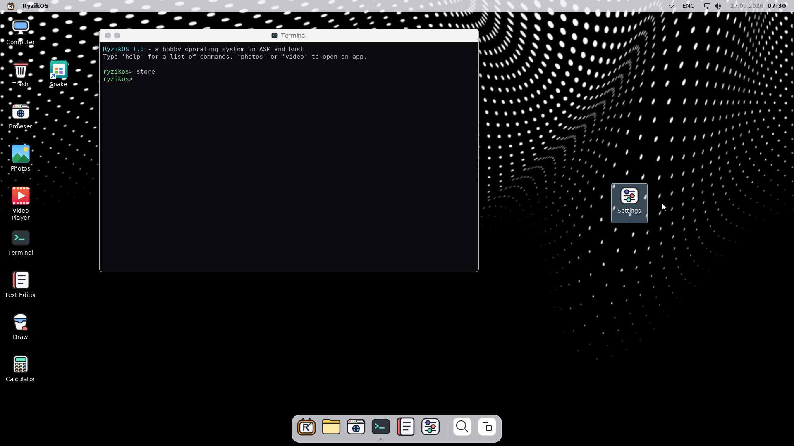
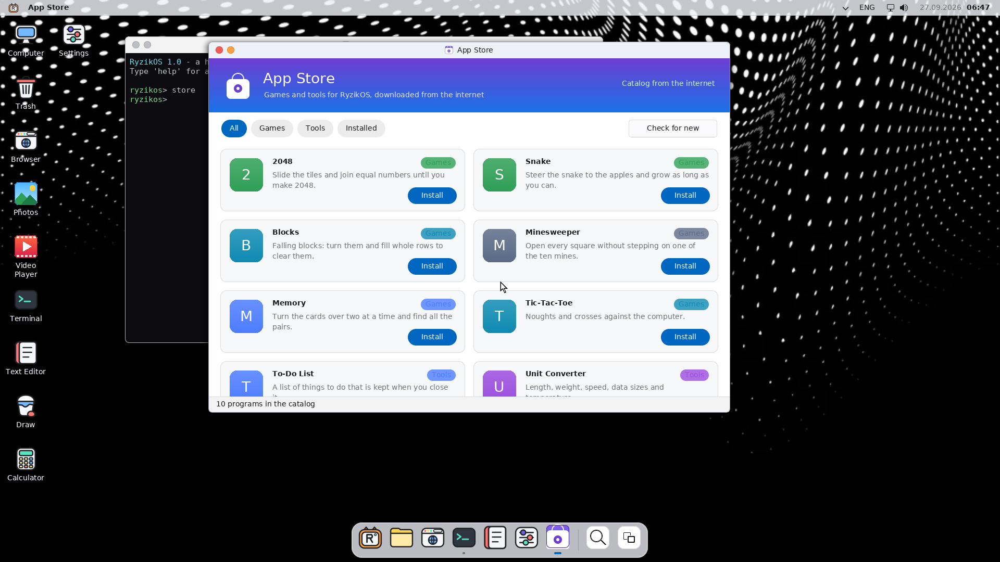
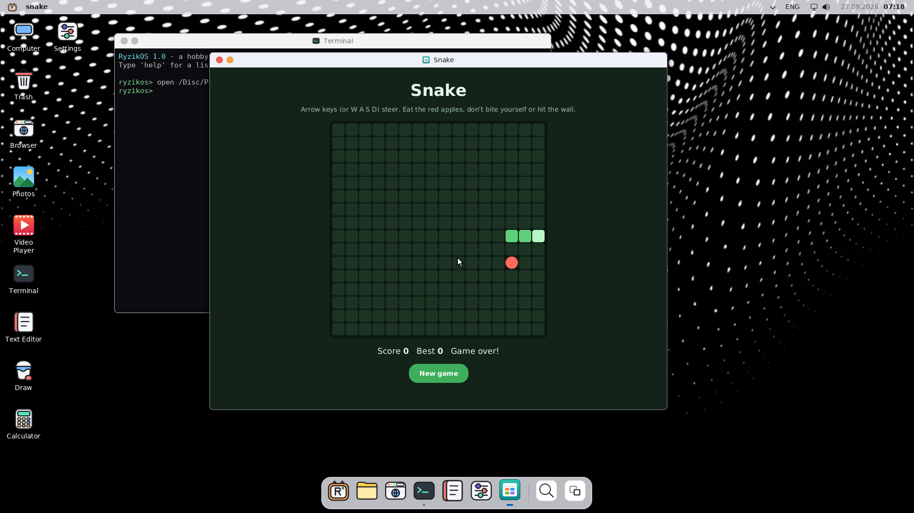
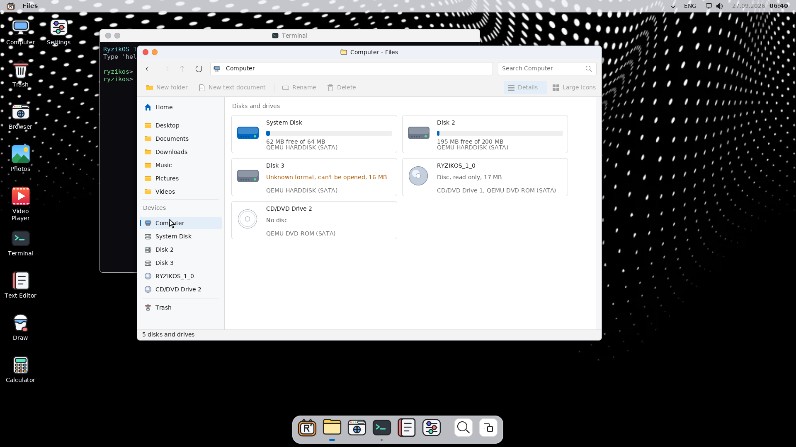

# RyzikOS 1.0

RyzikOS — любительская операционная система для x86_64, написанная с нуля на
ассемблере и Rust. Она загружается сразу в графический рабочий стол
1920x1080 со своими программами, браузером, магазином приложений и файлами
на диске.



## Что нового в 1.0

- **Все диски в «Файлах».** Драйверы IDE и SATA (AHCI) находят все жёсткие
  диски и CD/DVD-приводы. В «Файлах» есть раздел «Компьютер»: плитка на
  каждый диск со свободным местом и состоянием.
- **App Store.** Магазин программ с вкладками «Игры», «Инструменты» и
  «Установленные». Программы скачиваются из этого репозитория через
  интернет, а без интернета ставятся с диска RyzikOS.
- **Программы в своих окнах.** Установленная программа открывается в
  отдельном окне со своим названием и значком, а не во вкладке браузера.
- **Ярлыки на рабочем столе.** После установки программы на рабочем столе
  появляется её ярлык. Все значки можно перетаскивать, и они остаются на
  своих местах.
- **Фото и Видео.** Галерея с просмотром картинок и видеоплеер (MJPEG AVI).
- **Браузер** открывает сайты на jQuery, в том числе Википедию: раньше такие
  страницы были пустыми.
- **Звук.** Драйвер звуковой карты Ensoniq ES1370. Когда отпускаешь
  ползунок громкости, звучит короткий сигнал, как в Windows и macOS.
- **Меньше Windows.** Лаунчер вместо меню «Пуск», док внизу, строка меню
  сверху, «Files», «Computer», «Trash», пути вида `/Users/root`, сочетания
  клавиш с Super.

## Telegram, скриншоты и буфер обмена

- **Telegram.** Клиент Telegram из EverOS. Войти можно по QR-коду (на
  телефоне: Настройки → Устройства → Подключить устройство) или по номеру
  телефона с кодом, есть двухэтапная проверка. Скрепка рядом с полем ввода
  отправляет любой файл с диска, Ctrl+V отправляет картинку из буфера.
  Официальная сборка содержит api_id и api_hash RyzikOS, если они заданы в
  секретах репозитория `RYZIKOS_TG_API_ID` и `RYZIKOS_TG_API_HASH`. Без них
  Telegram один раз спросит ваши собственные с my.telegram.org.
- **Скриншоты.** PrintScreen или Super+Shift+S затемняют экран: выделите
  мышью область (Enter — весь экран, Esc — отмена). Снимок сохраняется в
  `Pictures/Screenshots` и попадает в буфер обмена: Ctrl+V вставляет его в
  Draw или отправляет в Telegram.
- **Вырезать, копировать, вставить.** Ctrl+X, Ctrl+C и Ctrl+V работают в
  полях ввода, адресной строке и формах браузера, в терминале (Ctrl+V
  вставляет, Ctrl+Shift+C копирует экран) и в калькуляторе. Правый клик в
  терминале, браузере, Telegram, настройках, калькуляторе и App Store
  открывает меню Cut, Copy, Paste, Select all.

## VPN

Приложение **VPN** (в лаунчере и в быстрых настройках, плитка VPN)
работает как Happ или v2rayNG: вставьте адрес подписки, который дал ваш
VPN-сервис (`https://...`, можно и `happ://add/https://...`), или ссылку
`vless://`, `trojan://`, `ss://` и нажмите Add. RyzikOS скачает список
серверов, покажет трафик и срок подписки и проверит задержку до каждого
сервера. Выберите сервер и нажмите большую кнопку.

Пока VPN включён, все программы (браузер, Telegram, App Store, обновления)
ходят в интернет через сервер, а имена сайтов тоже узнаёт сервер, так что
DNS-запросы не уходят в обычную сеть. Если сервер перестал отвечать,
соединения не идут в обход него. В строке меню горит зелёный щит.

- **Протоколы:** VLESS с REALITY или TLS, в том числе с flow
  `xtls-rprx-vision` (так настроено большинство платных подписок), Trojan и
  Shadowsocks (`aes-128-gcm`, `aes-256-gcm`, `chacha20-ietf-poly1305`).
  Для REALITY и Vision RyzikOS сам говорит TLS 1.3 и притворяется Chrome.
- **Пока нет:** транспорты WebSocket, gRPC, XHTTP, VMess и Shadowsocks 2022.
  Такие серверы видны в списке с пометкой «not supported».
- **Клавиши:** Enter включает и выключает, стрелки выбирают сервер, Ctrl+V
  добавляет ссылку из буфера, Ctrl+T проверяет задержки, F5 обновляет
  подписки.
- **Терминал:** `vpn add <адрес>`, `vpn list`, `vpn on [n]`, `vpn off`,
  `vpn test [n]`, `vpn status`, `vpn log`.

Подписки хранятся у каждого пользователя в `~/AppData/vpn.txt`.

## Live CD и установка

ISO — это live CD: RyzikOS запускается прямо с диска или флешки, всё
работает, но файлы хранятся в памяти до перезагрузки, а жёсткие диски не
меняются. Чтобы поставить систему насовсем, откройте «Install RyzikOS» на
рабочем столе (или `install` в терминале):

1. Выберите жёсткий диск (IDE или SATA).
2. Выберите «Стереть диск и установить» (FAT32 на весь диск, до 64 ГБ) или
   «Установить рядом с файлами», если на диске уже FAT32, размеченная
   RyzikOS. Перед стиранием установщик ещё раз спрашивает.
3. Установщик копирует ядро в `/boot` и записывает загрузчик GRUB в начало
   диска. Нажмите «Restart now».

После перезагрузки RyzikOS стартует с жёсткого диска и хранит файлы на
нём, а после первого входа открывается окно Welcome с тем, что можно
сделать первым делом (оно же есть в лаунчере). Если live CD остался в
приводе, его меню само выберет систему на жёстком диске через 4 секунды.
Установленная система обновляется из Настроек → Update.

## Что умеет

### Рабочий стол

- Экран блокировки с часами и панель входа. Сначала есть пользователь
  `root` без пароля: достаточно нажать Enter.
- Строка меню сверху: название активной программы, раскладка ENG/РУС, сеть,
  громкость, дата и время. Док внизу: закреплённые и открытые программы.
- Лаунчер (кнопка с логотипом или клавиша Super): сетка программ, поиск и
  ряд установленных программ.
- Окна со сглаженной графикой, тенями и анимациями. Их можно двигать,
  сворачивать и закрывать. Есть несколько рабочих столов и обзор окон.
- Значки на рабочем столе перетаскиваются куда угодно и прилипают к
  сетке. Правый клик по рабочему столу → «Arrange icons» выстраивает их
  заново. Файлы можно перетащить в папку или в корзину.
- Тёмная и светлая тема, обои (в том числе свои картинки).

### Программы

| Программа | Что делает |
| --- | --- |
| Files | Проводник: «Компьютер» со всеми дисками, папки пользователя, поиск, переименование, корзина |
| App Store | Магазин программ: установка через интернет или с диска, удаление, ярлык на рабочем столе |
| Browser | Веб-браузер со вкладками, HTTPS, CSS и JavaScript (подробнее ниже) |
| Photos | Галерея картинок из домашних папок, дисков и CD, просмотр с масштабом и поворотом |
| Video Player | Видео MJPEG AVI с перемоткой и повтором |
| Text Editor | Блокнот: открыть, сохранить, отмена, буфер обмена, UTF-8 и Windows-1251 |
| Draw | Рисование мышью: цвета, кисть, ластик, заливка |
| Terminal | Командная строка (список команд ниже) |
| Calculator | Калькулятор мышью или с клавиатуры |
| Settings | Экран, сеть, язык, пользователи, оформление, сведения о системе |
| Task Manager | Диспетчер задач (Ctrl+Shift+Esc): открытые программы, «Завершить задачу», графики процессора и памяти |

### Программы из App Store

Программы — это файлы `.rzapp` (HTML и JavaScript в одном файле) из папки
[`programs/`](programs). Список для магазина лежит в
[`programs/catalog.txt`](programs/catalog.txt): одна строка на программу в
виде `файл | название | категория | описание`. Чтобы добавить программу,
положите её в `programs/` и допишите строку в `catalog.txt`.

Сейчас есть 2048, Змейка, Блоки, Сапёр, Мемори, Крестики-нолики, Список
дел, Конвертер единиц и Секундомер.




### Диски и файлы

- Жёсткие диски IDE и SATA, файловая система FAT32 с длинными именами.
  Пустой диск RyzikOS сама размечает и форматирует, поэтому Windows и Linux
  потом могут открыть его.
- Первый диск — системный. Остальные диски FAT32 видны как `/Disk 2`,
  `/Disk 3` и так далее. Диски в других форматах (NTFS, ext4) показываются
  в списке, но открыть их нельзя.
- CD и DVD читаются (ISO 9660 с длинными именами) и видны как `/Disc`,
  `/Disc 2`. На диске RyzikOS есть примеры фото, видео и программы.
- У каждого пользователя своя папка `/Users/<имя>` с Desktop, Documents,
  Downloads, Pictures, Programs. Без жёсткого диска файлы живут в памяти до
  перезагрузки.



### Сеть и браузер

- Проводные сетевые карты: Intel e1000 и e1000e (82574, 82579, I217,
  I218, I219 — встроены в большинство плат с сетью Intel), Realtek
  RTL8111/8168/8169/8101 (самая частая сеть на домашних платах) и RTL8139.
  TCP/IP ([smoltcp](https://github.com/smoltcp-rs/smoltcp)), DHCP и DNS.
  В QEMU нужен флаг `-nic user,model=e1000` (подходят и `e1000e`,
  `rtl8139`). Wi-Fi пока нет.
- Команда `devices` в терминале показывает всё железо компьютера и то,
  для чего в RyzikOS есть драйвер.

### Звук

- Звуковая карта Ensoniq AudioPCI ES1370 (её эмулирует QEMU):
  16 бит, стерео, 22050 Гц, воспроизведение через DMA.
- Громкость задаётся ползунком в быстрых настройках (значок динамика в
  строке меню). Когда ползунок отпускаешь, звучит короткий сигнал новой
  громкости. Команда `beep` в терминале играет его же.
- В QEMU нужен флаг `-device ES1370` (на Windows
  `-audiodev dsound,id=snd0 -device ES1370,audiodev=snd0`, как в
  `run-windows.bat`). Без карты RyzikOS работает молча.
- HTTP/1.1 и HTTPS (TLS 1.3, [embedded-tls](https://github.com/drogue-iot/embedded-tls)),
  перенаправления, cookie, загрузка страниц в фоне.
- Свой движок страниц: HTML, CSS (flexbox, grid, таблицы, градиенты),
  JavaScript на [QuickJS](https://bellard.org/quickjs/) с DOM, таймерами,
  `fetch`, `localStorage`; картинки PNG и JPEG.
- Скачанные файлы сохраняются в Downloads, программы `.rzapp`
  устанавливаются в Programs.

Честно о пределах: страницы и видео пока без звука, нет `<canvas>`, WebGL, WebSocket, SVG и шрифтов с
сайтов, поэтому YouTube, VK и похожие сайты не заработают. Очень тяжёлые
страницы в QEMU без аппаратного ускорения грузятся медленно. Сертификаты
HTTPS не проверяются.

### Обновления

Настройки → Update сами проверяют, нет ли на GitHub новой сборки, и
скачивают её в фоне (заодно это происходит один раз после входа, когда
есть интернет). Остаётся нажать «Restart now»: после перезагрузки
работает новая версия. Номер версии виден там же и в About, например
1.0.7.

Обновления приходят только в установленную систему: новое ядро
сохраняется на её диск (скрытая папка `$Update`), и GRUB загружает его,
если оно новее установленного. Если с обновлением что-то не так, нажмите
Esc в первую секунду загрузки и выберите прежнюю версию, а в терминале
`update undo` удалит обновление. Live CD и сборки, сделанные у себя через
`make`, не обновляются.

### Команды терминала

`help`, `clear`, `echo`, `info`, `ls` (`dir`), `cd`, `pwd`, `cat`, `mkdir`,
`rm`, `echo текст > файл`, `devices` (железо и драйверы), `install` (установка с live CD, `install erase|keep <номер диска>` без вопросов), `update` (версия и скачанное обновление), `beep` (сигнал на звуковой карте), `open <файл>` (открыть файл или запустить
программу), `drives` (список дисков), `disc`, `store`, `browser [адрес]`,
`fetch <адрес>`, `notepad`, `explorer`, `photos`, `video`, `paint`, `calc`,
`settings`, `about`, `theme dark|light`, `wallpaper`, `whoami`, `users`,
`useradd`, `passwd`, `lock`, `restart`, `shutdown`, `exit`.

## Запуск на Windows

1. Установите QEMU: `winget install SoftwareFreedomConservancy.QEMU` или с
   [qemu.weilnetz.de/w64](https://qemu.weilnetz.de/w64/).
2. Возьмите ISO RyzikOS. Сборка из исходников даёт `build/everos.iso`
   (имя файла пока осталось от EverOS). Переименуйте его в `everos.iso`.
3. Положите рядом [`scripts/run-windows.bat`](scripts/run-windows.bat) и
   запустите его двойным щелчком. Он создаст диск `everos-disk.vhd` на
   128 МБ и запустит QEMU с live CD. Установите RyzikOS на этот диск, и
   при следующих запусках меню CD само загрузит её с диска.

Или вручную в PowerShell из папки с ISO:

```powershell
& "C:\Program Files\qemu\qemu-img.exe" create -f vpc -o subformat=fixed everos-disk.vhd 128M
& "C:\Program Files\qemu\qemu-system-x86_64.exe" -accel whpx,kernel-irqchip=off -accel tcg -cdrom everos.iso -boot d -m 512M -nic user,model=e1000 -audiodev dsound,id=snd0 -device ES1370,audiodev=snd0 -drive file=everos-disk.vhd,format=vpc,if=ide,index=0,media=disk
```

`run-windows.bat` включает аппаратное ускорение WHPX. Без него QEMU
эмулирует процессор программно, и вся система, особенно браузер, работает
в несколько раз медленнее. Чтобы ускорение заработало, один раз включите
компонент Windows «Платформа низкоуровневой оболочки Windows» (Windows
Hypervisor Platform): Пуск → «Включение или отключение компонентов
Windows», отметьте его и перезагрузите компьютер. Если WHPX недоступен,
QEMU сам вернётся к обычному режиму.

Файлы из RyzikOS можно посмотреть в Windows: закройте QEMU и дважды
щёлкните `everos-disk.vhd`. Перед следующим запуском извлеките этот диск.
Если окно не помещается на экран, нажмите Ctrl+Alt+F.

## На настоящем компьютере

Запишите ISO на флешку (например, Rufus в режиме DD или `dd`) или на
диск и загрузитесь с неё: получится live CD. Установщик ставит RyzikOS на
жёсткий диск IDE или SATA, флешка после этого не нужна. Загрузка — через
GRUB в режиме BIOS (на платах с UEFI включите CSM / Legacy Boot).
При стирании диска всё на нём удаляется, так что выбирайте диск без
Windows и нужных файлов. Работают: экран в разрешении,
которое дала прошивка, клавиатура и мышь PS/2, а USB-клавиатура и мышь —
если в BIOS включена Legacy USB Support,
диски IDE и SATA (AHCI), CD/DVD, проводная сеть на картах из списка выше.
Нет драйверов для Wi-Fi, NVMe, USB-флешек, встроенного звука (HD Audio) и
ускорения видеокарты. Команда `devices` покажет, что из железа вашего
компьютера RyzikOS видит и чем может пользоваться.

Чтобы проверить SATA и несколько дисков, запустите QEMU с `-machine q35` и
добавьте диски через `-device ide-hd,bus=ide.N`.

## Сборка из исходников

Нужны Rust (stable, через [rustup](https://rustup.rs); цель поставится сама
из `rust-toolchain.toml`), `nasm`, `clang`, `make`, `grub-mkrescue`,
`xorriso`, `mtools` и QEMU. На Ubuntu и Debian:

```sh
sudo apt install nasm build-essential clang grub-pc-bin grub-common xorriso mtools qemu-system-x86
```

```sh
make        # собрать build/everos.iso
make run    # запустить в окне QEMU с диском build/disk.img
make test   # загрузить без экрана и проверить рабочий стол, ввод, сеть, диск, CD и видео
make clean  # удалить сборку (диск build/disk.img остаётся)
```

Чтобы проверить VPN, запустите `python3 scripts/vpn-test-server.py путь/к/xray`
и в терминале RyzikOS наберите `vpn probe 127.0.0.1:8124/probe` и
`vpn add http://10.0.2.2:8124/sub`: появятся серверы VLESS REALITY, VLESS
TLS, Trojan и Shadowsocks, а страница `http://127.0.0.1:8124/page.html`
открывается только через VPN.

Чтобы проверить App Store со своим каталогом, соберите с
`RYZIKOS_CATALOG=http://10.0.2.2:8000/ make` и раздайте папку с
`catalog.txt` и программами на порту 8000.

## Как устроено

| Путь | Что там |
| --- | --- |
| `boot/` | загрузка: заголовок multiboot2, переход в 64-битный режим, прерывания |
| `kernel/src/gui/` | рабочий стол и программы: `mod.rs` (окна), `taskbar.rs` (док и строка меню), `start.rs` (лаунчер), `deskicons.rs` (значки), `explorer.rs`, `store.rs`, `browser.rs`, `photos.rs`, `video.rs`, `notepad.rs` и другие |
| `kernel/src/fs/` | диски и файлы: `ata.rs` (IDE), `ahci.rs` (SATA), `drive.rs`, `fat.rs` (FAT32), `iso9660.rs` (CD), `mod.rs` (пути и монтирование) |
| `kernel/src/net/`, `kernel/src/pci.rs` | сетевая карта e1000, TCP/IP, DHCP, DNS, шина PCI |
| `kernel/src/vpn/` | VPN: подписки и ссылки (`link.rs`), TLS 1.3 с REALITY (`tls.rs`), XTLS Vision (`vision.rs`), Shadowsocks (`ss.rs`), VLESS и Trojan (`mod.rs`) |
| `kernel/src/web/` | движок браузера: HTTP и HTTPS, DOM, CSS, раскладка, картинки, мост к JavaScript, каталог программ |
| `kernel/src/js/`, `kernel/quickjs/` | движок JavaScript QuickJS |
| `kernel/src/sound.rs` | звуковая карта ES1370 и сигнал громкости |
| `kernel/src/shell.rs` | терминал |
| `programs/` | программы `.rzapp` и `catalog.txt` для App Store |
| `iso/media/`, `scripts/gen-media.py` | фото и видео для CD |
| `scripts/boot-test.sh` | автоматическая проверка загрузки в QEMU |
| `scripts/vpn-test-server.py` | настоящий Xray с серверами всех протоколов для проверки VPN в QEMU |

## Лицензия

MIT, см. [LICENSE](LICENSE). Шрифт Terminus Font (c) Dimitar Toshkov Zhekov,
SIL Open Font License 1.1, см. [fonts/LICENSE.terminus](fonts/LICENSE.terminus).
Шрифты DejaVu: Bitstream Vera License и public domain, см.
[fonts/LICENSE.dejavu](fonts/LICENSE.dejavu).
Эмодзи в Telegram: [Twemoji](https://github.com/jdecked/twemoji) (c) Twitter, Inc
и другие авторы, CC-BY 4.0; картинки собраны из пакета `emoji-datasource-twitter`
скриптом `scripts/make-emoji.py`.
